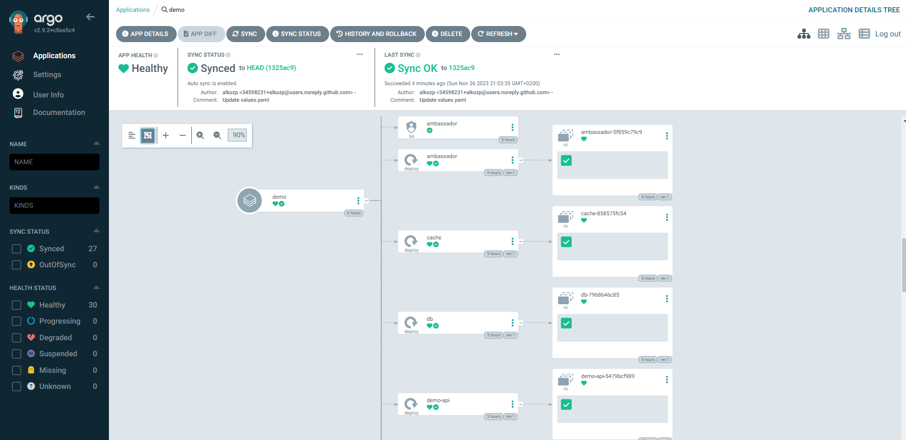

# Демо створення додатку у ArgoCD та налаштування автоматичної сінхронізації

Для прикладу - посилання на Git репозітарій додатка: [https://github.com/alkozp/go-demo-app ](https://github.com/alkozp/go-demo-app )

## Налаштування ArgoCD

Додавання аплікації

Параметри які потребують встановлення:
* Application Name -> `demo`
* Project Name -> `default`
* Repository URL -> `git url`
* Path -> `helm`
* Namespace -> `demo`
* AUTO-CREATE NAMESPACE -> `true`

Вигляд аплікації після створенння

Виконання сінхронізації проєкту

Типовий результат вдалої синхронізації

У разі виникнення змін у репозітарії аплікації зміни будуть автоматично застосовані для розгортання у kubernetes.

## Перевірка роботи тестової аплікації

`kubectl port-forward -n demo svc/ambassador 8088:80`

`curl localhost:8088`

`wget -O /tmp/img.png https://media.jfrog.com/wp-content/uploads/2023/09/01001006/DEVOPS-DEFINED_INFINITY-ICON.png`

`curl -F 'image=@/tmp/img.png' localhost:8088/img/`

Як результат отримуємо зображення конвертоване у ascii малюнок

