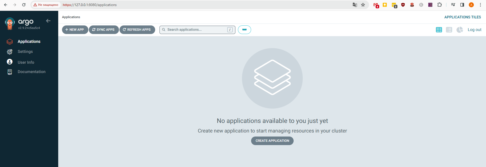

Для етапу Proof of Concept (PoC) пропонуеться розгорнути ситему автоматичної доставки розробляємого додатку до кластеру kubernets у оточенні GitHub Codespaces.

# Налаштування kubernetes

У Codespaces встановлюемо розширення K3D, та за допомогою командого рядка виконуемо налаштування кластеру

`k3d cluster create asciiartify`

# Налаштування ArgoCD

Встановлення ArgoCD у кластері

`kubectl create namespace argocd`

`kubectl apply -n argocd -f https://raw.githubusercontent.com/argoproj/argo-cd/stable/manifests/install.yaml`

Налаштування мережевого доступу

`kubectl port-forward svc/argocd-server -n argocd 8080:443&`

Отримання пароля для першого входу для користувача admin

`kubectl -n argocd get secret argocd-initial-admin-secret -o jsonpath="{.data.password}" | base64 -d; echo`

Перевіряємо доступність додатку за адресою `https://127.0.0.1:8080/`

